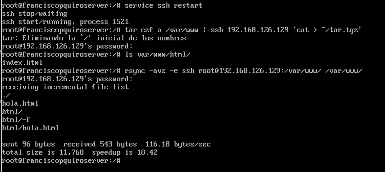
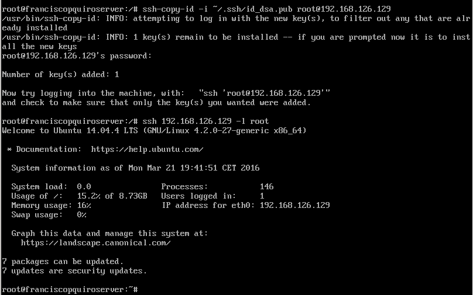
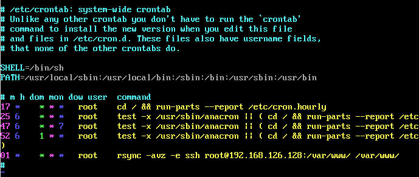

#Practica 2

* En la siguiente imagen podemos ver que he clonado una carpeta ssh de una máquina a otra.

* Creamos una clave en una máquina y la copiamos en la otra para poder acceder mediante ssh sin autenticación. Podemos verlo en esta imagen.

* Por ultimo añadimos al archivo crontab una linea para clonar de forma automática la carpeta vista antes.
