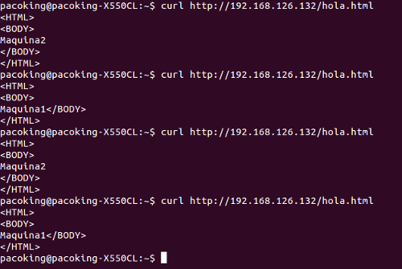

#Práctica 3
- Francisco Alfonso Peña Quiros

##-Configurando NGINX

* Tras la instalación de nginx, realizando el proceso indicado en la práctica, añado el contenido que debería tener el archivo **/etc/nginx/conf.d/default.conf**.

* Tras guardar el archivo reiniciamos el servicio y comprobamos mediante los mensajes de salida que no hay problemas.

* Modifico el cron de la máquina 2 y modificamos los fichero **hola.txt** de los servidores finales, para que cuando se soliciten con _curl_ se vean las diferencias.

* También comprobamos el balanceo mediante ponderación añadiendo "pesos" de carga distintos a los servidores:

	weight = 2
	weight = 1

Obtenemos como respuesta a lo solicitado:

##-Configurando Haproxy

* Realizo el mismo proceso para que funcione haproxy. Este es el contenido del archivo **/etc/haproxy/haproxy.cfg**.

* Tras salvar el archivo comprobamos que funciona perfectamente el balanceo. Para ello se debe de iniciar el servicio de una manera diferente a lo habitual:

	/usr/sbin/haproxy -f /etc/haproxy/haproxy.cfg

* Finalmente, como parte optativa usamos _Zen Load Balancer_ como balanceador de carga. Simplemente se instala la _ISO_ descargada en una nueva máquina que sera el balanceador.

* Aquí vemos la pantalla de instalación.*: 

	

* Vamos indicando como si instalaramos ubuntu server y le asignamos una IP que no este ocupada en nuestra red. Cuando concluya la instalación seguiremos estos pasos:

	1. Abriremos, desde el sistema anfitrion, un navegador y pondremos _https://<ip_asignada>:444/_ la cual nos pedira las credenciales admin/admin.

	2. Una vez dentro, entraremos en _Settings -> Interfaces_ y añadiremos una interface virtual.

	3. Posteriormente, vamos a _Manage -> Farms_ y añadimos una nueva granja indicando un nombre con el profile por defecto. 

	4. Seleccionaremos la Ip virtual creada anteriormente y pondremos el puerto 80.

	5. Pulsaremos editar sobre la "_granja_" creada para añadir los servidores finales.

	6.Encontraremos este recuadro y pondremos las ip finales.
	

	7. Ya solo hace falta comprobar que todo funciona correctamente y listo.