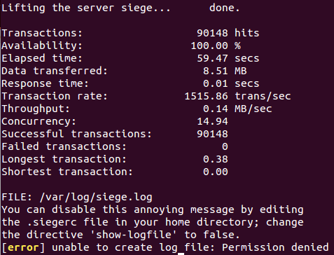

#Práctica 4
- Francisco Alfonso Peña Quiros

##-Pruebas con ApacheBenchmark

* Debemos realizar las pruebas a 1 servidor y con balanceo de carga con la siguiente orden de comandos
**ab -n 1000 -c 5 http://ip_maquina.com/prueba.html**.

* Mostramos las siguientes imágenes con las pruebas de rendimientos en los 3 casos.

	

	

	

* Tras las series de pruebas, realizamos las medias de los tiempos obtenidos y mostramos las gráficas resultantes. Las dispersiones se encuentran en el **.xml**.

	

	

Tambien hay que decir que el valor **Failed requests** es de 0 en todas las pruebas, por eso no muestro imagen de ello.

##-Pruebas con Siege

* Para Siege, del mismo modo que con ApacheBenchmark, usamos la siguiente linea de comandos:
**./siege -b -t60S -v http://ip_maquina.com/prueba.html**

* Ahora muestro algunas de las imágenes obtenidas tras las pruebas.

	

	

	

* Y ahora muestro las gráficas conseguidas, de las métricas más importantes,  por las series de pruebas realizadas con Siege.

	

	

	

	
