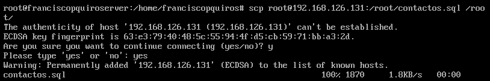

#Práctica 5
- Francisco Alfonso Peña Quiros

##-Creación de la BD 

* Como primer paso, usamos la interfaz de linea de comandos de MySQL, y para ello debemos escribir **mysql -u root -p**.

* Los pasos a seguir se pueden ver en la siguiente imagen.

	

* En este punto, ya tenemos datos introducidos en nuestra nueva BD.

##-Replicar la BD con mysqldump

* Como primer paso para realizar un replica, debemos de tener en cuenta la posible actualización en el servidor donde se encuentra la BD. Por ello:

1. Debemos evitar el acceso a la BD.
2. Entramos a la interfaz al igual que antes.
3. Y escribimos **FLUSH TABLES WITH READ LOCK;**

* Después de este paso, ya podemos guardar los datos de la BD. La linea a escribir es **mysqldump contactos -u root -p > /root/contactos.sql**

* Ahora, quitamos el bloqueo en la BD (dentro de la interfaz) mediante **UNLOCK TABLES;**

* En el otro servidor, queremos copiar los datos que hemos guardados en el server1 y para ellos realizamos lo que muestra la siguiente figura.

	

*  Tras estos pasos, debido a que mysqldump no introduce las sentencias de creación de la BD, debemos crear una BD en el server2 con el mismo nombre que en el otro servidor.

* Por ultimo, debemos restaurar los datos contenidos en la BD. Se realizaría de esta manera **mysql -u root -p contactos < /root/contactos.sql**

##-Replicar la BD con configuración maestro-esclavo

* Tras lo realizado anteriormente, hemos visto que se puede replicar la BD pero con un factor humano. Ahora queremos que cualquier cambio producido en el server1 se haga al instante en el otro servidor. 

1. Debemos tener ya clonada la base de datos en los servidores. 

2. Seguimos en el server que vayamos a usar como maestro y entramos en el archivo de configuración **/etc/mysql/mt.cnf**

3. Dentro del archivo comentamos con un # la linea donde aparece **bind-address 127.0.0.1**.

4. Por defecto, no debería aparecer comentada la linea donde indica la ruta del archivo de errores, lo verificamos e intentamos que aparezca algo semejante a : **log_error = /var/log/mysql/error.log**

5. Indicamos el identificador del servidor (esta linea debe aparecer comentada, solo la descomentamos): **server-id = 1**

6. Y lo mismo para el registro binario: **log_bin = /var/log/mysql/bin.log**.

7. Reiniciamos el servicio mediante **/etc/init.d/mysql restart**.

* Para el servidor 2 realizamos el mismo proceso en el archivo de configuración con la diferencia en el identificador, que en este caso ponemos el número 2.

* Reiniciamos aquí también el servicio y si no se ha producido ningún fallo todo estará bien.

* Tras este proceso, debemos volver al maestro y ejecutar las sentencias que se muestran en la figura.

	

8. Se deben activar las tablas como ya hemos indicado anteriormente.

9. En el esclavo, ejecutamos esta sentencia que en mi caso quedaría:  ** CHANGE MASTER TO MASTER_HOST='192.168.126.131', MASTER_USER='esclavo', MASTER_PASSWORD='esclavo', MASTER_LOG_FILE='mysql-bin.000003', MASTER_LOG_POS=501, MASTER_PORT=3306**;

10. Iniciamos el esclavo con **START SLAVE**. Ejecutamos **SHOW SLAVE STATUS\G** y debería aparecer algo como en la siguiente imagen:

	

* Donde en el campo **Seconds_Behind_Master" debe de aparecer un 0 para saber que todo funciona correctamente.

* Para terminar, solo haría falta comprobar que si se realiza una inserción en el maestro debe de aparecer de forma inmediata en el esclavo.